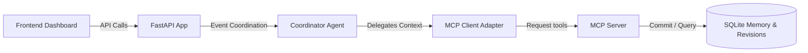
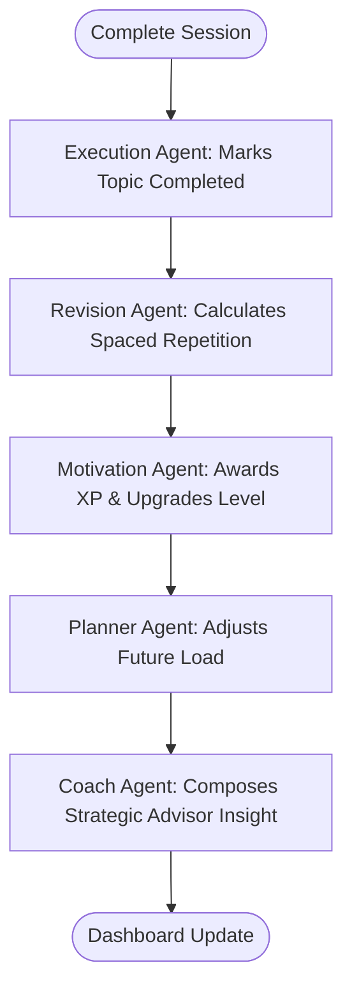

# StudyQuest AI — Autonomous Multi-Agent Study Coach

StudyQuest AI is an autonomous, gamified study coach designed to help students actually complete their study goals. Instead of acting as a static task manager, StudyQuest AI plans, monitors, motivates, schedules revisions, and actively coaches you all the way to exam day.

Built for **Kaggle's AI Agents: Intensive Vibe Coding Capstone**.

---

## 🚀 Key Features & Competitions Edge

- **Autonomous Multi-Agent Coordination**: Orchestrates 5 specialist agents (Planner, Execution, Revision, Motivation, Coach) sequentially via a central coordinator workflow to manage study roadmaps.
- **Syllabus Ingestion**: Accepts raw text or uploaded PDF syllabus documents, sanitizes input, extracts topic candidates, and distributes study workloads.
- **Study Memory via local MCP Tools**: Persists preferred daily study hours, completed topic logs, weak categories, and revision metrics inside a local SQLite memory store exposed to agents via 7 Model Context Protocol tools.
- **Adaptive Spaced Repetition**: Schedules upcoming review intervals dynamically based on student comprehension confidence. Shifts dates to balance daily workloads and caps revisions before exam dates.
- **Strategic AI Coach Feed**: Formulates progress-aware diagnostic advising logs based on study history.
- **Polished Command Center Dashboard**: A dark-themed command deck rendering today's mission, countdowns, course completion rings, unlocked badges, and the live agent collaboration activity log.

---

## 📸 Screenshots & Previews

### 1. Dashboard Command Center
`[Screenshot Placeholder: Dark command deck layout displaying count down timers, mission cards, progress bars, and the AI coach feed]`

### 2. Autonomous Agent Activity Log
`[Screenshot Placeholder: Terminal-style feed rendering sequential steps of the 5 agents: Execution completed, Revision scheduled, Motivation awarded, Planner adjusted workload, Coach compiled advisor note]`

### 3. Syllabus Wizard Compiler
`[Screenshot Placeholder: Wizard setup panel showing exam forms, optional PDF file upload widgets, and extracted topic preview tags]`

---

## 📐 System Architecture & Flows

For a detailed breakdown, see [docs/architecture.md](docs/architecture.md).

### High-Level Request Path


### Multi-Agent Workflows


---

## ⚡ Quick Start: Running Locally

### Prerequisites
- Node.js (v18+)
- Python (v3.11+) with the `uv` package manager installed (`pip install uv`)

---

### 1. Unified Concurrent Launcher
Use the execution launcher in the root folder to start FastAPI, Next.js, and FastMCP simultaneously:
```bash
chmod +x run_all.sh
./run_all.sh
```

---

### 2. Manual Startup

#### Setup and Start Backend Services
```bash
cd backend
# Sync packages
uv sync

# Run the FastAPI server
uv run uvicorn app.fast_api_app:app --port 8000 --reload
```
- API Docs: `http://localhost:8000/docs`

#### Start local MCP server
```bash
cd backend
uv run python mcp/mcp_server.py
```

#### Setup and Start Frontend Dashboard
```bash
cd frontend
npm install
npm run dev
```
- Client View: `http://localhost:3000`

---

## 🧪 Demo Scenario: The 30-Day Biology Quest

We have built a pre-configured scenario to demonstrate the full multi-agent workflow in under 3 minutes:

1. **Reset Demo**: Click **Load Biology Demo** on the dashboard. This resets the SQLite database and seeds:
   - Subject: **Biology**
   - Countdown: **30 Days**
   - Streak: **4 Days** (Level 1, 380 XP, 40 Coins)
   - Today's mission: **Study Cell Division**
   - Starting Coach greeting.
   - Initial Planner Agent trace logs.
2. **Complete Session**: Click **Complete Session** on today's mission card, pick **confidence 3**, and click **Record Success**.
3. **Observe Collaboration Workflow**:
   - The **XP** increases to **500**, triggering a **Level Up to Level 2** and awarding **+15 Coins**.
   - The **Streak** increments to **5 days**.
   - A revision is scheduled for **Cell Division** in **3 days** (based on confidence 3).
   - The **Coach advisor** updates to: *"Cell Division is complete with moderate confidence (3/5). I scheduled review in 3 days. Tomorrow's workload has been adjusted..."*
   - The **Agent Activity Log** displays the sequential logs of all 5 agents (Execution -> Revision -> Motivation -> Planner -> Coach).

---

## 🔧 Environment Configuration (.env)
Create `backend/.env` containing:
```env
GEMINI_API_KEY=your_gemini_api_key
PORT=8000
ALLOW_ORIGINS=http://localhost:3000
```
*Note: If no API key is configured, StudyQuest AI activates **Fallback Mode** automatically. Agents fall back to local database stubs, preserving the entire demo scenarios.*

---

## 📂 Repository File Tree

```
StudyQuest-AI/
├── backend/
│   ├── agents/
│   │   ├── coordinator.py     # Root Coordinator Agent
│   │   ├── planner.py         # Planner Agent
│   │   ├── execution.py       # Execution Agent
│   │   ├── revision.py        # Revision Agent
│   │   ├── motivation.py      # Motivation Agent
│   │   ├── coach.py           # Coach Agent
│   │   ├── tools.py           # ADK Tools declarations
│   │   └── schemas.py         # Validation schemas
│   ├── mcp/
│   │   └── mcp_server.py      # FastMCP tool server
│   ├── app/
│   │   └── fast_api_app.py    # FastAPI JSON Endpoints
│   ├── services/
│   │   ├── db.py              # SQLite schemas and memory stubs
│   │   ├── study_service.py   # Ingestion, buffer plans, and coach insights
│   │   └── spaced_rep_service.py # Load balance scheduling algorithms
│   ├── utils/
│   │   └── mcp_client.py      # Client adapter with failover hooks
│   ├── scripts/
│   │   └── smoke_test.py      # Automated API smoke tester
│   └── pyproject.toml         # Python environment packages
├── frontend/
│   ├── src/app/
│   │   └── page.tsx           # Dashboard UI component
│   └── package.json           # Next.js configurations
├── evals/
│   └── eval_cases.json        # Evaluation test vector configurations
├── docs/
│   ├── architecture.md        # Technical component maps
│   ├── demo-script.md         # Narrative presentation script
│   ├── security_review.md     # Size caps and validation limits
│   └── antigravity.md         # IDE handoff guidelines
└── run_all.sh                 # Unified stack launcher
```

---

## 🔒 Security & Upload Validation
- **Extension whitelist**: Only `.txt` and `.pdf` files are accepted.
- **Payload limits**: Maximum file sizes are limited to **2MB**.
- **Path Sanitation**: Filenames are sanitized using regex filters to block path traversal.
- **Immediate Cleanup**: Upload files are deleted immediately after text parsing; folder paths are never returned in JSON payloads.
