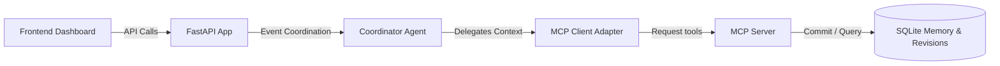
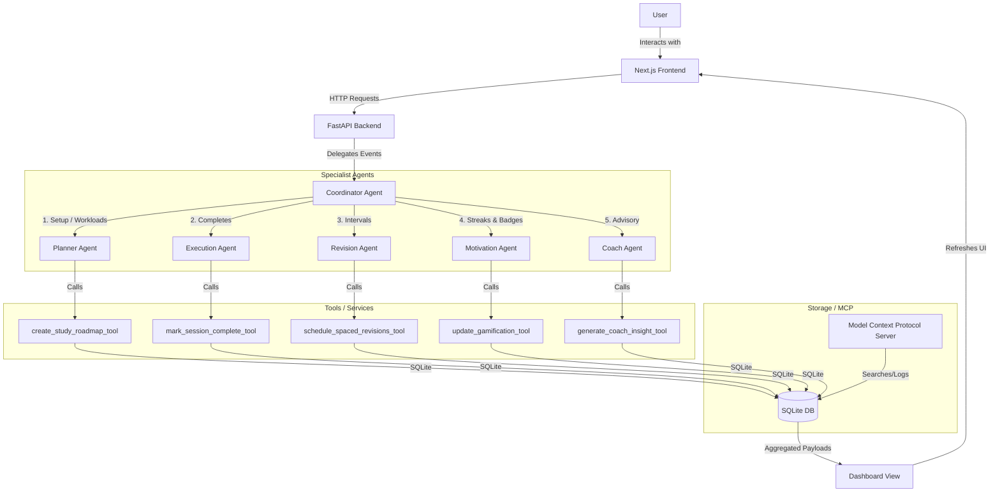
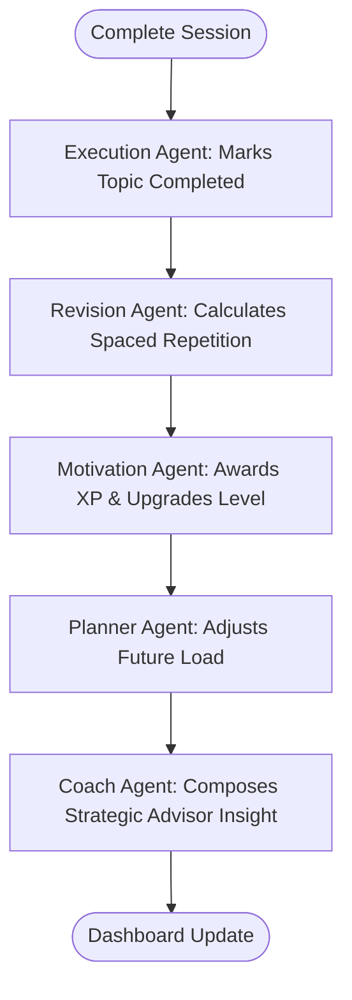
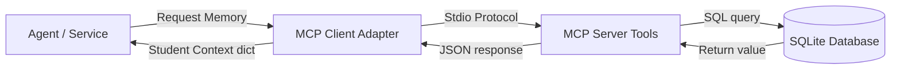

# StudyQuest AI Architecture

This document describes the technical architecture and multi-agent topology of **StudyQuest AI**, an autonomous study coach MVP.

## High-Level request flow

## System Topology Diagram

The diagram below outlines the interaction between the client, API backend, Google ADK Agents, and the SQLite storage layer.

## Component Architecture

### 1. Frontend: Next.js Client
A visual, dark-themed dashboard command center rendering:
- **Daily Mission**: Focus item to execute.
- **Spaced Repetition Queue**: Tracks dynamic intervals (Day 1, 3, 7, 14, 30).
- **Gamification Deck**: XP meters, level metrics, coin stores, streaks.
- **Coach Panel**: strategic study insights.
- **Achievements drawer**: Locked/unlocked badges.

### 2. Backend: FastAPI Server
Exposes high-speed, type-safe JSON endpoints for data CRUD, and acts as the runtime host for the ADK multi-agent engine:
- `GET /api/dashboard`: Aggregates current user profile, streak, today's mission, revision, coach messages, achievements, and readiness metrics.
- `POST /api/exam/setup`: Initializes the study roadmap.
- `POST /api/session/complete`: Marks a mission complete, awards XP/coins, schedules spaced repetition revisions, and runs the coach diagnostic checks.
- `POST /api/pomodoro/log`: Logs completed Pomodoro focus blocks.

### 3. Google ADK Multi-Agent System
Organized as a sequential coordinator managing collaborative agent duties:
- **Planner Agent**: estimates work volumes, extracts syllabus topics, and writes roadmaps.
- **Execution Agent**: watches tasks and validates completions.
- **Revision Agent**: schedules spaced repetition intervals based on student confidence scores.
- **Motivation Agent**: runs streaks, levels, and unlocks badges.
- **Coach Agent**: evaluates overall study metrics to compose context-aware advising notes.

### 4. Storage: SQLite Database
Stores relational student metrics in a local `studyquest.db` file with schemas for:
- `users`: levels, XP, coins, streaks, last active.
- `exams`: target name, date, hours.
- `syllabus_topics`: topic name, completion status, confidence ratings.
- `daily_missions`: date, duration, completion status.
- `revisions`: revision dates, confidence ratings, completion status.
- `achievements`: badge definitions and unlock dates.
- `coaching_messages`: text feed of coach logs.

---

## 🔁 Agent Collaboration Workflow Diagram

The flowchart below traces the sequential delegation loop triggered upon study session completions:

---

## 🗃️ MCP Memory Flow Diagram

The diagram below maps how StudyQuest agents interface with the local Model Context Protocol tools to persist and fetch student context:

